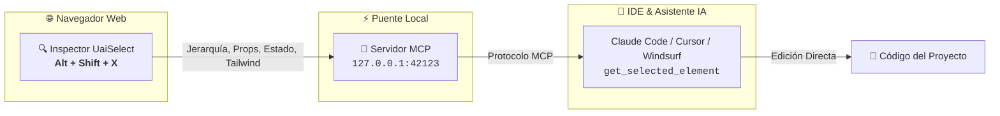

<div align="center">

<a href="https://github.com/Dearxia1/UaiSelect">
  
</a>

### *Inspector Visual de UI y Puente de Contexto para Desarrolladores*

Extrae la jerarquía de componentes React/Vue, hooks de estado, props, clases Tailwind y capturas de pantalla directamente a tu asistente de IA (**Claude Code**, **Cursor**, **Windsurf**, **Claude Desktop**) con **cero copiar y pegar**.

[**English 🇺🇸**](README.md) • [**Español 🇪🇸**](README.es.md) • [**npm: uaiselect-mcp**](https://www.npmjs.com/package/uaiselect-mcp)

[](https://developer.chrome.com/docs/extensions/mv3/)
[](https://addons.mozilla.org/en-US/firefox/addon/uaiselect-uiinspector-devtools/)
[](https://www.npmjs.com/package/uaiselect-mcp)
[](https://modelcontextprotocol.io/)
[](https://ko-fi.com/danielmejiaruales)
[](LICENSE)

</div>

---



---

## ⚡ Inicio Rápido MCP en 1 Minuto

Añade este único bloque de configuración a tu editor para activar la inspección nativa del navegador en tu IA:

```json
{
  "mcpServers": {
    "uaiselect": {
      "command": "npx",
      "args": ["-y", "uaiselect-mcp"]
    }
  }
}
```

### ¿Dónde se pega esta configuración?

* **Claude Code for VS Code**: Crea `.mcp.json` en la raíz de tu proyecto *(Escribe `/mcp` en el chat para verificar 🟢)*.
* **Cursor IDE**: Pega en `~/.cursor/mcp.json` o ve a **Settings > Features > MCP**.
* **Claude Desktop**: Pega en `%APPDATA%\Claude\claude_desktop_config.json` (Windows) o `~/Library/Application Support/Claude/claude_desktop_config.json` (macOS).
* **Windsurf / Roo Code / Cline**: Añade en `mcp_config.json`.

---

## 🚀 Cómo Funciona (Flujo Zero-Copy con IA)

1. **Inspecciona el Elemento**: Pulsa <kbd>Alt</kbd> + <kbd>Shift</kbd> + <kbd>X</kbd> en tu navegador y haz clic en cualquier componente.
2. **Pídele a tu IA**: En tu chat del IDE (Claude Code, Cursor, Windsurf), habla en lenguaje natural:
   > *"Refactoriza el componente que seleccioné en el navegador para agregarle un estado de loading y ajustar el padding con Tailwind."*
3. **Acción Instantánea**: La IA ejecuta `get_selected_element`, extrae la jerarquía (`App > AuthProvider > Navbar > Button`), props, estado, clases Tailwind, y aplica los cambios directamente en tu código.

---

## 🆚 DevTools Tradicional vs. UaiSelect

| Tarea | DevTools Convencional | Con UaiSelect + MCP |
| :--- | :--- | :--- |
| **Inspeccionar Elemento** | Abrir F12, buscar elemento en el árbol DOM | <kbd>Alt</kbd> + <kbd>Shift</kbd> + <kbd>X</kbd> + Clic |
| **Extraer Contexto para la IA** | Copiar HTML y CSS a mano y escribir el prompt | Payload automático vía MCP |
| **Estado y Props de React/Vue** | Requiere extensión de React DevTools y buscar | Extracción instantánea de props y hooks |
| **Lectura de Clases Tailwind** | Copiar strings largos y desordenados | Lista categorizada de clases utilitarias |
| **Captura de Toda la Web** | Comandos complejos en la consola | Ensamblado automático con 1 clic |

---

## 🛠️ Referencia de Herramientas MCP

El paquete `uaiselect-mcp` se ejecuta directamente vía `npx` y expone 5 herramientas:

| Herramienta MCP | Propósito |
| :--- | :--- |
| `get_selected_element` | Devuelve la jerarquía del componente, snippet HTML, clases Tailwind, estilos, props y hooks de estado. |
| `get_element_prompt` | Genera un prompt estructurado predefinido (`fix-visual`, `add-feature`, `refactor`, `tailwind-convert`, `explain`). |
| `get_component_hierarchy` | Devuelve la ruta en el árbol de componentes desde la raíz (`App > Layout > Card > Button`). |
| `get_element_styles_and_props` | Devuelve estilos calculados de CSS, dimensiones, props de React/Vue y estado activo. |
| `open_element_source` | Solicita abrir el componente en VS Code, Cursor o Windsurf. |

---

## ✨ Características Principales

* 🎯 **Overlay Visual en Shadow DOM**: Cero colisión o fuga de estilos hacia la página host.
* ⚛️ **Detección de Frameworks**: Inspección de árboles React Fiber (Props, Hooks, State) y componentes Vue.
* 🎨 **Extracción de Tailwind**: Clasificación limpia de utilidades, métricas de layout y CSS computado.
* 📸 **Captura Aislada & Toda la Web**: Motor de scroll vertical y ensamblado con anti-duplicación de navbars fijas.
* 📋 **Exportación Multi-Formato**: Presets de prompts en Markdown y JSON estructurado para flujos personalizados.
* 🔒 **100% Local & Privado**: Todo el procesamiento ocurre exclusivamente en tu navegador y en `127.0.0.1:42123`.

---

## 📦 Instalación de la Extensión en el Navegador

### 🦊 Mozilla Firefox

#### 1. Tienda Oficial (Instalación en 1 Clic)
* **[Instalar UaiSelect en Firefox Add-ons](https://addons.mozilla.org/en-US/firefox/addon/uaiselect-uiinspector-devtools/)**

#### 2. Instalación Manual / Modo Desarrollador (Local)
1. En Firefox, entra a la dirección `about:debugging#/runtime/this-firefox`
2. Haz clic en el botón **"Cargar complemento temporal..."**
3. Selecciona el archivo `dist-firefox/manifest.json` dentro de tu carpeta del proyecto.

---

### 🌐 Google Chrome / Brave / Edge (Modo Desarrollador)

```bash
# 1. Clonar y compilar
git clone https://github.com/Dearxia1/UaiSelect.git
cd UaiSelect
npm install
npm run build

# 2. En Chrome, abre chrome://extensions
# 3. Activa "Modo de desarrollador" (interruptor superior derecho)
# 4. Haz clic en "Cargar descomprimida" y selecciona la carpeta "dist"
```

---

## ⌨️ Atajos de Teclado

| Atajo | Acción |
| :--- | :--- |
| <kbd>Alt</kbd> + <kbd>Shift</kbd> + <kbd>X</kbd> | Activar / Desactivar el inspector visual |
| <kbd>Clic Izquierdo</kbd> | Seleccionar elemento y abrir panel lateral |
| <kbd>↑</kbd> (Flecha Arriba) | Seleccionar elemento padre en el DOM |
| <kbd>↓</kbd> (Flecha Abajo) | Seleccionar primer elemento hijo |
| <kbd>Esc</kbd> | Cancelar / Salir del modo selección |

---

## 🛠️ Scripts para Desarrolladores

```bash
npm run dev        # Iniciar servidor de desarrollo Vite para el sidepanel
npm run build      # Compilar Chrome (dist/) y Firefox (dist-firefox/)
npm run mcp        # Probar el puente del servidor MCP local
npm run package    # Generar archivos zip de lanzamiento en releases/
```

---

## ☕ Apoyo & Comunidad

UaiSelect es libre y de código abierto. Si te resulta útil en tu día a día, considera apoyar su desarrollo:

<div align="center">

[](https://ko-fi.com/danielmejiaruales)

</div>

---

## 📄 Licencia

MIT License. Consulta el archivo [LICENSE](LICENSE) para más detalles.
