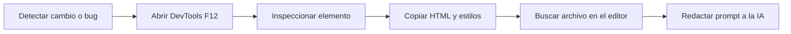
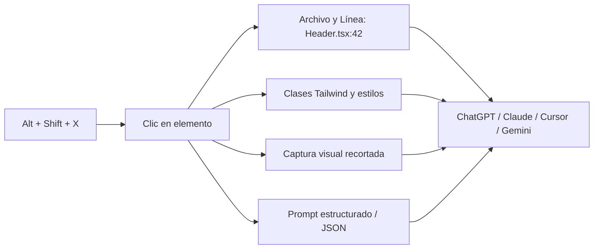
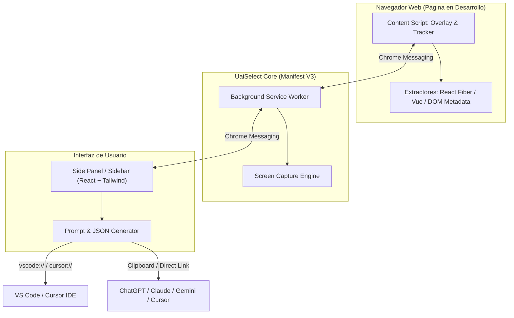

<div align="center">

# UaiSelect

**AI UI Inspector & Context Extractor for Web Developers**

*Selecciona cualquier elemento visual en tu navegador y extrae su contexto de código fuente directamente para asistentes de IA.*

[](https://developer.chrome.com/docs/extensions/mv3/)
[](https://addons.mozilla.org/)
[](https://ko-fi.com/danielmejiaruales)
[](https://react.dev/)
[](https://tailwindcss.com/)
[](https://www.typescriptlang.org/)
[](LICENSE)

</div>

---

## Flujo de Trabajo

### Flujo Tradicional (DevTools)



### Con UaiSelect



---

## Características

| Característica | Descripción |
| :--- | :--- |
| **Inspector Visual** | Overlay aislado en Shadow DOM con detección en tiempo real de componente, archivo y métricas. |
| **Click-to-Source** | Obtención del archivo y línea exacta (`src/components/Header.tsx:42`) mediante React Fiber (`_debugSource`) y Vite Inspector (`data-v-inspector`). |
| **Integración con IDE** | Acceso directo en 1 clic a **VS Code** (`vscode://`) y **Cursor** (`cursor://`). |
| **Jerarquía de Componentes** | Ruta del árbol de componentes (`App > DashboardLayout > Navbar > UserAvatar > button`). |
| **Clases Tailwind & CSS** | Clasificación de clases utilitarias de Tailwind, dimensiones, padding, margin y paleta de colores. |
| **Captura Visual Recortada** | Instantánea ajustada al elemento respetando la escala y el DPR de la pantalla. |
| **Doble Formato: Prompt & JSON** | Generación de prompts en Markdown con presets técnicos o exportación en **JSON estructurado** para APIs y agentes. |
| **Procesamiento 100% Local** | La extracción se ejecuta exclusivamente en el navegador local. |

---

## Arquitectura



---

## Instalación

### Google Chrome / Brave / Microsoft Edge / Opera

1. **Clonar e instalar dependencias:**
   ```bash
   git clone https://github.com/Dearxia1/UaiSelect.git
   cd UaiSelect
   npm install
   npm run build
   ```
2. Accede a `chrome://extensions/` en tu navegador.
3. Activa el **Modo de desarrollador** en la esquina superior derecha.
4. Haz clic en **Cargar descomprimida** y selecciona la carpeta **`dist`**.

---

### Mozilla Firefox

1. **Compilar el proyecto:**
   ```bash
   npm run build
   ```
2. En Firefox, ingresa a `about:debugging#/runtime/this-firefox`.
3. Haz clic en **Cargar complemento temporal...**.
4. Selecciona el archivo **`dist-firefox/manifest.json`**.

---

## Atajos de Teclado

| Atajo | Acción |
| :--- | :--- |
| <kbd>Alt</kbd> + <kbd>Shift</kbd> + <kbd>X</kbd> | Activar / Desactivar el inspector visual |
| <kbd>Clic Izquierdo</kbd> | Seleccionar elemento y abrir panel lateral |
| <kbd>↑</kbd> (Flecha Arriba) | Seleccionar elemento padre en el DOM |
| <kbd>↓</kbd> (Flecha Abajo) | Seleccionar primer elemento hijo |
| <kbd>Esc</kbd> | Cancelar y salir del modo selección |

---

## Scripts

```bash
# Servidor de desarrollo
npm run dev

# Compilación de producción (Chrome en dist/ y Firefox en dist-firefox/)
npm run build

# Empaquetado de archivos .zip para tiendas
npm run package
```

---

## Apoyo

UaiSelect es un proyecto de código abierto y de uso gratuito. Si te resulta útil en tu flujo de trabajo, puedes apoyar su desarrollo:

<div align="center">

[](https://ko-fi.com/danielmejiaruales)

</div>

---

## Licencia

MIT License. Consulta el archivo [LICENSE](LICENSE) para más detalles.
