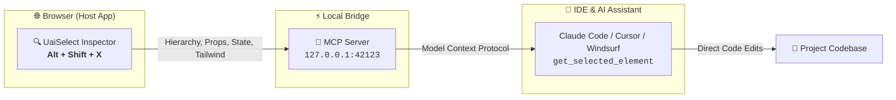

<div align="center">

<a href="https://github.com/Dearxia1/UaiSelect">
  
  
</a>

### *AI UI Inspector & Context Bridge for Modern Web Developers*

Extract React/Vue component hierarchy, state hooks, props, Tailwind classes, and snapshots directly into your AI coding assistant (**Claude Code**, **Cursor**, **Windsurf**, **Claude Desktop**) with **zero manual copy-pasting**.

[**Español 🇪🇸**](README.es.md) • [**English 🇺🇸**](README.md) • [**npm: uaiselect-mcp**](https://www.npmjs.com/package/uaiselect-mcp)

[](https://developer.chrome.com/docs/extensions/mv3/)
[](https://addons.mozilla.org/)
[](https://www.npmjs.com/package/uaiselect-mcp)
[](https://modelcontextprotocol.io/)
[](https://ko-fi.com/danielmejiaruales)
[](LICENSE)

</div>

---



---

## ⚡ 1-Minute MCP Quickstart

Add this single configuration block to your editor to enable native browser inspection in your AI agent:

```json
{
  "mcpServers": {
    "uaiselect": {
      "command": "npx",
      "args": ["-y", "uaiselect-mcp"]
    }
  }
}
```

### Where to paste this config:

* **Claude Code for VS Code**: Create `.mcp.json` in your project root *(Type `/mcp` in chat to verify 🟢)*.
* **Cursor IDE**: Paste in `~/.cursor/mcp.json` or go to **Settings > Features > MCP**.
* **Claude Desktop**: Paste in `%APPDATA%\Claude\claude_desktop_config.json` (Windows) or `~/Library/Application Support/Claude/claude_desktop_config.json` (macOS).
* **Windsurf / Roo Code / Cline**: Add to `mcp_config.json`.

---

## 🚀 How It Works (Zero-Copy AI Workflow)

1. **Inspect Element**: Press <kbd>Alt</kbd> + <kbd>Shift</kbd> + <kbd>X</kbd> in your browser and click any UI component.
2. **Prompt Your AI**: In your IDE chat (Claude Code, Cursor, Windsurf), ask naturally:
   > *"Refactor the component I selected in the browser to add a loading state and tweak the Tailwind padding."*
3. **Instant Action**: The AI tool executes `get_selected_element`, pulls the component hierarchy (`App > AuthProvider > Navbar > Button`), props, state, Tailwind utility classes, and applies the code changes directly to your codebase.

---

## 🆚 DevTools vs. UaiSelect

| Task | Traditional DevTools | With UaiSelect + MCP |
| :--- | :--- | :--- |
| **Inspect UI Element** | Open F12, find element in DOM tree | <kbd>Alt</kbd> + <kbd>Shift</kbd> + <kbd>X</kbd> + Click |
| **Extract Context for AI** | Manually copy HTML, styles, and write prompt | Automatic context payload via MCP |
| **React/Vue State & Props** | Requires React DevTools extension & digging | Instant extraction of props and state hooks |
| **Tailwind Class Parsing** | Long string copy-pasting | Clean list of categorized utility classes |
| **Full Page Screenshot** | Complex console commands | 1-click full scrollable page stitcher |

---

## 🛠️ MCP Tools Reference

The `uaiselect-mcp` package runs directly via `npx` and exposes 5 tools:

| MCP Tool | Purpose |
| :--- | :--- |
| `get_selected_element` | Returns component hierarchy, HTML snippet, Tailwind classes, custom styles, props, and state hooks. |
| `get_element_prompt` | Generates a structured prompt preset (`fix-visual`, `add-feature`, `refactor`, `tailwind-convert`, `explain`). |
| `get_component_hierarchy` | Returns ancestor tree path from root to inspected component (`App > Layout > Card > Button`). |
| `get_element_styles_and_props` | Returns computed CSS styles, dimensions, React/Vue props, and active state values. |
| `open_element_source` | Requests opening the target component in VS Code, Cursor, or Windsurf. |

---

## ✨ Core Features

* 🎯 **Shadow DOM Visual Overlay**: Zero style leakage onto host pages.
* ⚛️ **Framework Detection**: Inspects React Fiber trees (Props, Hooks, State) and Vue components.
* 🎨 **Tailwind Extraction**: Separates Tailwind utility classes, layout metrics, and computed CSS.
* 📸 **Full-Page & Isolated Capture**: Automated scrolling page-stitcher with navbar anti-duplication algorithms.
* 📋 **Multi-Format Export**: Markdown prompt presets and raw structured JSON for custom AI pipelines.
* 🔒 **100% Local & Private**: All processing happens exclusively inside your browser and localhost (`127.0.0.1:42123`).

---

## 📦 Browser Extension Installation

### 🦊 Mozilla Firefox
Install with 1 click from the official store:
* **[Get UaiSelect on Firefox Add-ons](https://addons.mozilla.org/)**

---

### 🌐 Google Chrome / Brave / Edge (Developer Mode)

```bash
# 1. Clone and build
git clone https://github.com/Dearxia1/UaiSelect.git
cd UaiSelect
npm install
npm run build

# 2. In Chrome, open chrome://extensions
# 3. Enable "Developer mode" (top right)
# 4. Click "Load unpacked" and select the "dist" folder
```

---

## ⌨️ Keyboard Shortcuts

| Shortcut | Action |
| :--- | :--- |
| <kbd>Alt</kbd> + <kbd>Shift</kbd> + <kbd>X</kbd> | Toggle visual inspector on / off |
| <kbd>Left Click</kbd> | Select element and open sidepanel |
| <kbd>↑</kbd> (Arrow Up) | Select DOM parent element |
| <kbd>↓</kbd> (Arrow Down) | Select first child element |
| <kbd>Esc</kbd> | Cancel / Exit inspection mode |

---

## 🛠️ Developer Scripts

```bash
npm run dev        # Start Vite dev server for sidepanel
npm run build      # Build Chrome (dist/) and Firefox (dist-firefox/)
npm run mcp        # Test local MCP server bridge
npm run package    # Generate release zip archives in releases/
```

---

## ☕ Support & Community

UaiSelect is free and open-source. If it speeds up your daily workflow, consider supporting its development:

<div align="center">

[](https://ko-fi.com/danielmejiaruales)

</div>

---

## 📄 License

MIT License. See [LICENSE](LICENSE) for details.
