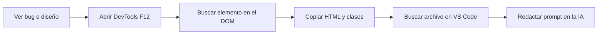
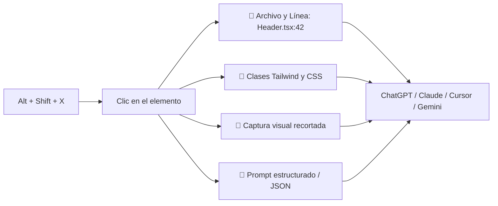

<div align="center">

# 🎯 UaiSelect

**The AI UI Inspector & Prompt Generator for Modern Web Developers**

*Selecciona cualquier elemento visual en tu navegador y conecta tu código fuente directamente con la IA.*

[](https://developer.chrome.com/docs/extensions/mv3/)
[](https://addons.mozilla.org/)
[](https://ko-fi.com/danielmejiaruales)
[](https://react.dev/)
[](https://tailwindcss.com/)
[](https://www.typescriptlang.org/)
[](LICENSE)

</div>

---

## ⚡ El Problema vs. La Solución

### ❌ Flujo Tradicional (Fricción y pérdida de tiempo)



### ✅ Con UaiSelect (1 Clic, flujo instantáneo)



---

## ✨ Características Principales

| Característica | Descripción |
| :--- | :--- |
| 🎯 **Inspector Visual** | Overlay aislado con Shadow DOM. Muestra badges en tiempo real con nombre de componente, archivo y dimensiones. |
| 📁 **Click-to-Source** | Detecta automáticamente la ubicación real del archivo (`src/components/Header.tsx:42`) mediante React Fiber (`_debugSource`) y Vite Inspector (`data-v-inspector`). |
| 🚀 **Deep Linking IDE** | Botones de 1 clic para abrir el archivo directamente en **VS Code** (`vscode://`) o **Cursor** (`cursor://`). |
| 🌳 **Jerarquía de Componentes** | Visualiza la ruta completa del componente (`App > DashboardLayout > Navbar > UserAvatar > button`). |
| 🎨 **Extracción Tailwind & CSS** | Filtra clases utilitarias de Tailwind, detecta dimensiones, display/flex, padding, margin y paleta de colores. |
| 📸 **Captura Recortada** | Genera una captura de pantalla nítida y ajustada al elemento considerando la escala y el DPR de la pantalla. |
| 🤖 **Modo Dual: Prompts & JSON** | Genera prompts optimizados con presets (*Fix Visual*, *Feature*, *Refactor*, *Tailwind*, *Explain*) o exporta un payload **JSON estructurado** para APIs y agentes. |
| 🔒 **100% Privado y Local** | Toda la extracción y procesamiento se realiza en tu máquina local. Ningún dato sale de tu navegador. |

---

## 🏗️ Arquitectura Técnica


---

## 📦 Instalación

### 🌐 Google Chrome / Brave / Microsoft Edge / Opera

1. **Clonar e instalar dependencias:**
   ```bash
   git clone https://github.com/Dearxia1/UaiSelect.git
   cd UaiSelect
   npm install
   npm run build
   ```
2. Abre `chrome://extensions/` en tu navegador.
3. Activa el **Modo de desarrollador** (arriba a la derecha).
4. Haz clic en **Cargar descomprimida** y selecciona la carpeta **`dist`**.

---

### 🦊 Mozilla Firefox

1. **Compilar el proyecto:**
   ```bash
   npm run build
   ```
2. En Firefox, ingresa a `about:debugging#/runtime/this-firefox`.
3. Haz clic en **Cargar complemento temporal...**.
4. Selecciona el archivo **`dist-firefox/manifest.json`**.

---

## ⌨️ Atajos de Teclado

| Atajo | Acción |
| :--- | :--- |
| <kbd>Alt</kbd> + <kbd>Shift</kbd> + <kbd>X</kbd> | Activar / Desactivar el inspector visual |
| <kbd>Clic Izquierdo</kbd> | Seleccionar elemento y abrir panel lateral |
| <kbd>↑</kbd> (Flecha Arriba) | Subir al elemento padre en el DOM |
| <kbd>↓</kbd> (Flecha Abajo) | Bajar al primer elemento hijo |
| <kbd>Esc</kbd> | Cancelar y salir del modo selección |

---

## 🛠️ Scripts de Desarrollo

```bash
# Iniciar servidor de desarrollo
npm run dev

# Compilar versiones para producción (Chrome en dist/ y Firefox en dist-firefox/)
npm run build

# Generar archivos .zip listos para subir a las tiendas oficiales
npm run package
```

---

## ☕ Apoya el Proyecto

UaiSelect es un proyecto 100% de código abierto y gratuito. Si te ayuda a ahorrar tiempo en tu día a día como desarrollador, puedes invitarme un café:

<div align="center">

[](https://ko-fi.com/danielmejiaruales)

</div>

---

## 📄 Licencia

Este proyecto está bajo la Licencia MIT. Consulta el archivo [LICENSE](LICENSE) para más información.
